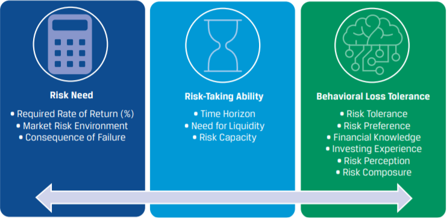
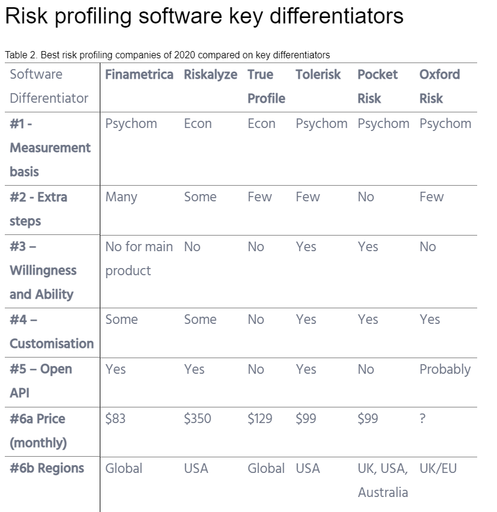
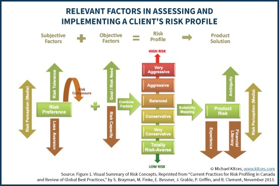

# Investment Risk Portfolio

## [CFA Institute](https://www.cfainstitute.org/-/media/documents/survey/investment-risk-profiling.ashx)

-   3 dimensions of an investment risk portfolio (IRP)
    -   need for risk
        -   rate of return (RoR) considered --> suggests potential asset allocation strategies
        -   market risk enviroment
        -   consequence of failure
    -   ability to take risk
        -   time horizon, liquidity need
        -   risk capacity
    -   behavioural loss tolerance
        -   can make or break a carefully devised **quantative** portfolio
        -   best practice is to use pyschometric tools (ours)

-   Difference between risk and uncertainty
    -   risk refers to the degree of potential financial loss inherent in an investment decision, generally measured by volatility
    -   Uncertainty refers to a situation in which a decision maker lacks information about known probabilities before making a decision
    -   For example, investment decisions are uncertain, whereas gambling decisions involve risk
    -   Investors tend to be more averse to uncertainty than to risk. As a result, investors are apt to act based on perceptions of risk rather than on actual risk (from Michael Joseph Roszkowski and Geoff Davey, “Risk Perception and Risk Tolerance Changes Attributable to the 2008 Economic Crisis: A Subtle but Critical Difference,” Journal of Financial Services Professionals 64, no. 4 (July 2010): 42–53.)
-   an advisor should estimate a unique IRP for each **goal**

## Risk need

### Summary

| Portfolio Composition of Growth Assets Necessary to Meet RoR (%) | Risk-Need Categorization |
| ---------------------------------------------------------------- | ------------------------ |
| Less than 30%                                                    | Low                      |
| Between 30% and 70%                                              | Moderate                 |
| Greater than 70%                                                 | High                     |

FRAMEWORK FOR ESTABLISHING AN INVESTOR’S RISK NEED

1. What is the investor’s goal?
2. What is the future value need ($)?
3. What is the present value of investment account ($)?
4. What is the time horizon for accomplishing stated goal (years)?
5. What is the regular saving to (+) / spending from (–) the account?
6. What is the frequency of saving/spending (monthly/quarterly/yearly/occasionally)?
7. What is the estimated required RoR (%) to meet stated goal?
8. Given capital markets expectations and the current market risk environment, is this RoR realistic to obtain?
9. DECISION POINT:
    - Proceed or stop and revise goal and/or savings rate.
10. Financial consequence of failing to meet stated goal, if any:
    - Acceptable, unacceptable, unknown.

## Risk Ability

-   goal time horizon as well

### Time Horizon Summary

| Time Horizon      | Classification |
| ----------------- | -------------- |
| <= 5 Years        | Short          |
| \>5 and <10 Years | Intermediate   |
| \>= 10 Years      | Long           |

### Liquidity Need Summary

| Liquidity Need Horizon                                                            | Classification                 |
| --------------------------------------------------------------------------------- | ------------------------------ |
| An absence of expected distributions                                              | Low liquidity need / high risk |
| A net (after advisory fees) expected or ongoing annual distribution need of >= 5% | High liquidity need / Low risk |

-   risk capacity
    -   refers to an investor’s financial capability to withstand a financial loss without meaningfully compromising her desired standard of living

### Risk Ability Summary

If EITHER of the following situations is present, the investor’s ability to take risk is LOW:

-   Time horizon is less than or equal to five years.
-   The expected and/or ongoing annual liquidity need is greater than or equal to 5% of the portfolio value and no outside income or assets (e.g., employment income, access to credit, cash savings, insurance) are available to maintain standard of living in case of an emergency.
    If ALL of the following scenarios are present, the investor’s ability to take risk is HIGH:
-   Time horizon is greater than or equal to 10 years.
-   Investor has no expected and/or ongoing annual liquidity needs that are greater than 5% of the portfolio value.
-   Sufficient outside income or assets (e.g., current income, access to credit, cash savings, insurance) are available to maintain standard of living in case of an emergency.

Otherwise, the investor’s ability is MODERATE.

## Behavioral Loss Tolerance

-   an investor's behavioral loss tolerance can be described by 6 things
    1. risk tolerance
    2. risk preference
    3. financial knowledge
    4. investing experience
    5. risk perception
    6. risk composure

### Risk tolerance

-   willingness to take risk --> the maximum amount of uncertainty an investor is wiling to accept when making a financial decision
-   2 most common methods are psychologically driving and economics driven

...

-   Time horizon and risk capacity questions should generally not be included in a risk tolerance questionnaire or test

-   a pyschometrically valid and reialbe risk-tolerance questionaire is the preferred method for measure risk tolerance

## [Advisors Edge](https://www.advisor.ca/my-practice/conversations/why-risk-assessments-should-be-at-the-centre-of-client-relationships/)
- “It’s hard for me to wrap my head around the fact that many institutions rely on five multiple choice questions to determine risk tolerance, when it takes me at least an hour of follow-up questions to ensure that I am building a portfolio that is truly suitable for each individual client, in good markets and in bad,”
- need-based goal, objective ability to take risks, and behavioural risk tolerance is the above CFA source
- freeing up time to allow advisors to spend more time elsewhere

## [risk offerings + comparisons](https://www.stackup.io/news/the-best-risk-profiling-and-risk-tolerance-software-in-2020/)
- Areas of interest 
  1. Psychometric vs. econometric methods
  2. Risk profiling as a process vs. a questionnaire
  3. Willingness vs. willingness and ability to take risk
  4. White label and customisation vs. no customisation
  5. Open API vs. no API
  6. Pricing and availability by region

1. Psychometric vs. econometric methods

   * Psychometric risk profiling
     * risk tolerance to losses
     * reaction to gains
     * portfolio allocation preferences
     * financial knowledge
     * capacity to take risk (although this isn’t strictly ‘risk tolerance’ it is sometimes included in a risk tolerance quiz)
     * A statistical property of these psychometric surveys is that the more questions they ask, the more accurate their result are. So on average, psychometric risk profiling questionnaires are longer than econometric profiling methods
   * Econometric risk profiling
     * newer
     * based more directly on classical economic and behavioural finance theory compared to psychometric methods and typically encompass ideas of utility theory and prospect theory as a basis for their assessment.
2. Risk profiling methods as a process
   *  higher financial literacy is at least correlated with higher risk tolerance. A recent paper by the CFA institute, [CFA risk tolerance questionnaire](https://www.cfainstitute.org/-/media/documents/book/rf-publication/2018/risk_compilation_2018.ashx), goes into detail about the theoretical underpinnings of this.
3. Willingness to take risk, or willingness and ability to take risk
   * While terms are often confused and interchanged, willingness and ability to take risk are separate constructs and should be measured separately
   * Some providers provide risk tolerance software that only measures willingness, while others provide risk profile software that combines willingness and ability into a final score.
   * Willingness refers to how a client’s psychology affects their comfort level related to financial risk
   * Ability, on the other hand, refers to capacity related factors, such as time horizon and level of financial strength. 

...

## [Why It’s Best To Measure Risk Tolerance With #FinTech Questionnaires Instead Of (Just) Risk Conversations](https://www.kitces.com/blog/why-its-best-to-measure-risk-tolerance-with-fintech-questionnaires-instead-of-just-risk-conversations/)

...

## [The Sorry State Of Risk Tolerance Questionnaires For Financial Advisors](https://www.kitces.com/blog/risk-tolerance-questionnaire-and-risk-profiling-problems-for-financial-advisors-planplus-study/)

### The Risk Profile
   - Tolerance
   - Capacity
   - Risk Perception
   - Risk capacity is an objective measure (the dollars-and-cents mathematical analysis of the consequences of risky events)
   - risk tolerance (and risk perception) remains more subjective (an assessment of an abstract psychological trait)
   - the combination of all of those subjection and objective factors that characterize the client’s entire “risk profile”, which in turn will lead to investment recommendations that may vary from very-aggressive to very-conservative.

- many risk tolerance questionnaires (RTQs) don’t actually do a very good job of helping to predict a client’s actual investment behavior during volatile markets