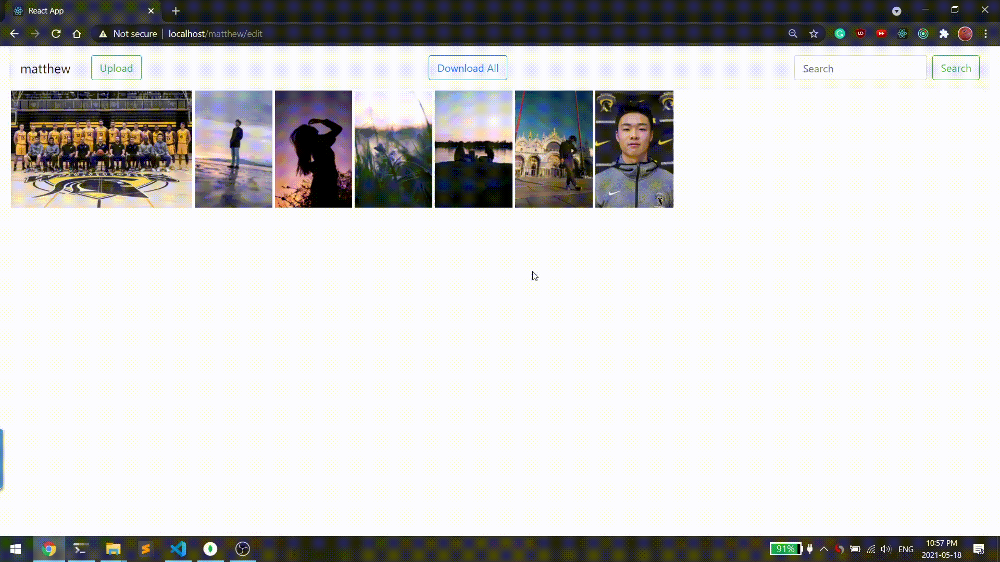

# imagerepo

My vision of this project is to create a base template or "image" of an image uploading platform that I can use for future projects. 

One of those future projects involves incorporating a lot of machine learning with uploading pictures such as determine if a photo is "good" or "bad", searching by description/objects, etc.

## Features *more currently in development!

### Users

Currently, it's a really basic user structure. I wanted to have a url path similar to Instagram's. There is no registration, but I plan to implment that soon!

## Uploading

Working on a progress bar similar to google photos or drive soon!

Note that most of the files I uploaded are large camera photos (~24 MB), so the delay is expected (similar to Google Photos).

Technical:

1. Files are posted as a list of File objects with FormData. 
2. I use Pillow to preprocess the image and generate a compressed and thumbnail photo
3. I store all these the compressed image, thumbnail, and raw image into Mongo with the GridFS specification
4. Image links are returned 

## Downloading

Working on a progress bar similar to google photos or drive soon!

Technical:

1. Files are queried for by username
2. Files zipped into a streaming data response
   * I don't think we can make a progress bar with a streaming response, so I'll have to change that in the future
3. Zipped file returned

## Deleting coming soon!

## Running

### Docker

Production:
1. `docker-compose up` in root `PROD=true` in the `.env` file

Develop:
* Not really a dev workflow at the moment, since not hot reloading --> should be different docker-compose file
1. `docker-compose up` in root `PROD=false` in the `.env` file

### Normal
Frontend:
1. `cd frontend`
2. `npm i`
2. `npm start`

Backend:
1. `cd backend`
2. install requirements in your virtual env of choice! 
3. `python3 main.py`

Mongo: 
1. Spin up a mongo instance, I used docker with the `docker-compose-dev.yml` file
2. Otherwise spin up mongo and fill in the connection details in `main.py`. I used defaults of port `27017` and user/pass as `root/rootpassword`

## Todos

### Features
* possibly create UID for each user if duplicate usernames allowed
* add upload progress per image like google photos
    * https://www.nginx.com/resources/wiki/modules/upload_progress/
    * or I think there is axios support for upload progress?
        * https://www.youtube.com/watch?v=Ti8QNiRRzOA
* I guess better ui huh?  
* add better error codes/catching
* proper 3rd party ssl certificates which will remove need for checking ip or domain accessed

### Optimizations

* move logic/api calls into parent component
* disable react dev tools + redux dev tools for production 
* change mongo user/pass to docker secrets and create defined readwrite user, don't use root
* create dev dockerfiles + dev dockercompose for dev workflow
    * binded volume mounts for hot reloading
* possibly switch to one nginx instance?
* implement chunked file uploading frontend
* implement chucked file reponses
* optimize image preprocessing --> merge processed file and thumb fail to one function?
* optimize image stuff --> blobs, urls? 
    * https://www.bignerdranch.com/blog/dont-over-react-rendering-binary-data/

## Interesting links/searches about file uploading practices
* https://stackoverflow.com/questions/4083702/posting-a-file-and-associated-data-to-a-restful-webservice-preferably-as-json
* https://stackoverflow.com/questions/53725760/does-multipart-form-data-sends-the-whole-file-data-at-one-go-or-in-a-stream
* https://stackoverflow.com/questions/2502596/python-http-post-a-large-file-with-streaming
* axios can't start download notif with content-disposition header --> nasty workaround
   * create objectFromUrl, create and click on link :(
* send url back for images 
